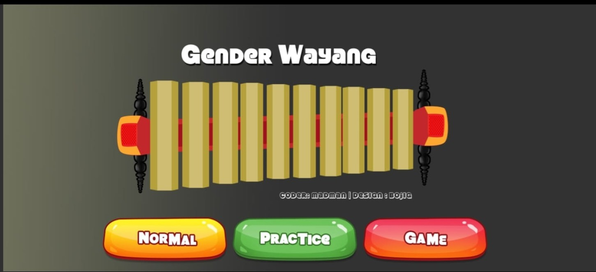
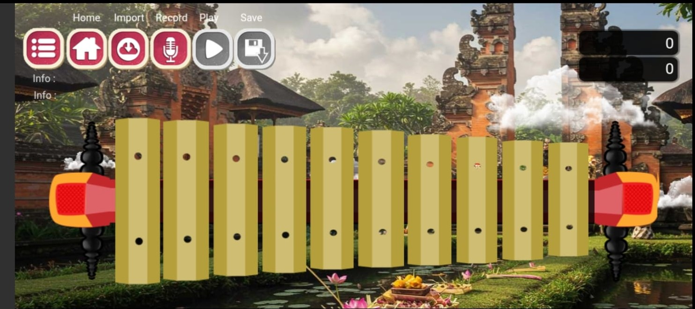
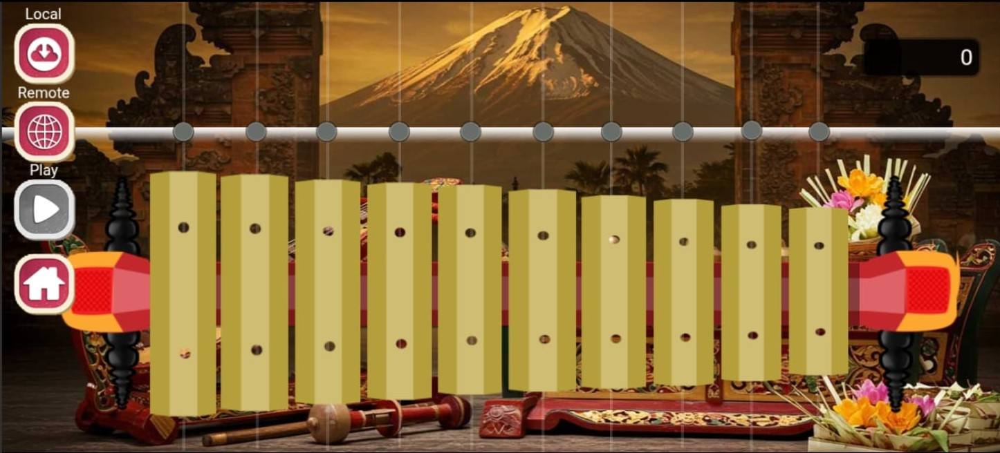
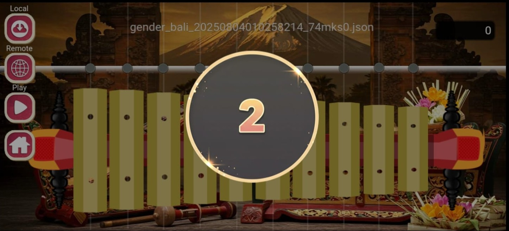
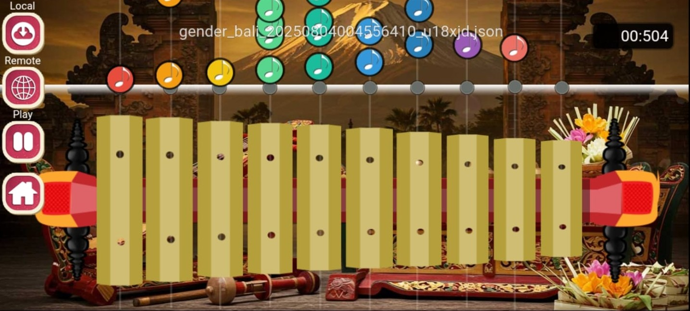
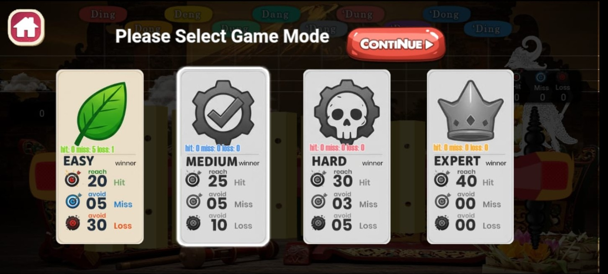
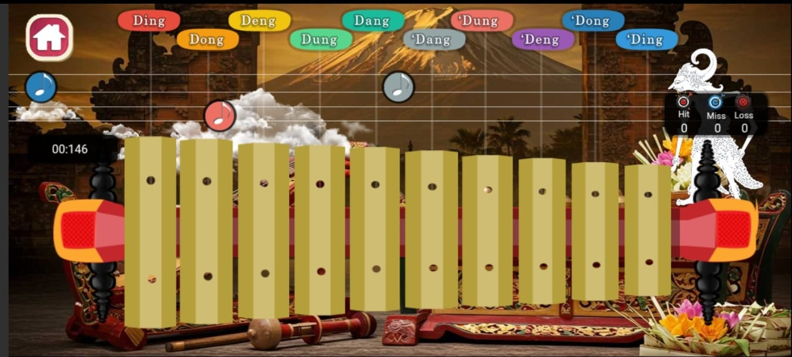
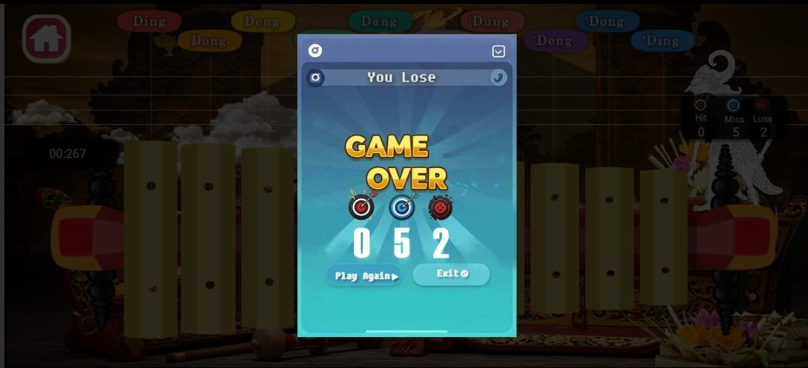

# 🎶 Gender Wayang Bali - Android App

Aplikasi Android tentang **Gamelan tradisional Bali** khususnya **Gender Wayang**.  
Aplikasi ini dibuat untuk memperkenalkan, mempelajari, dan memainkan musik Gender Wayang dengan cara modern melalui smartphone.

---

## ✨ Fitur Utama
1. **Komposer Lagu**  
   - Pengguna dapat membuat atau menyusun lagu Gender Wayang.  
   - Lagu dapat disimpan dalam **file terenkripsi**.  
   - Lagu yang tersimpan bisa diputar kembali melalui aplikasi.  

2. **Belajar Gender Wayang**  
   - Pengguna pemula dapat belajar memainkan Gender berdasarkan **file lagu (JSON)**.  
   - Lagu bisa berasal dari **server** maupun dibagikan oleh teman/ahli Gender.  

3. **Game Edukatif**  
   - Permainan sederhana untuk membantu pengguna **mengingat nada-nada** pada bilah-bilah Gender.  
   - Belajar sambil bermain, menjadikan pengalaman lebih menyenangkan.  

---

## 📱 Tujuan
Aplikasi ini bertujuan untuk:  
- Melestarikan budaya **Gamelan Bali**.  
- Membantu generasi muda mengenal **Gender Wayang** dengan cara modern.  
- Menjadi media belajar sekaligus hiburan.

---
## 📱 App Screenshots

| | | |
|---|---|---|
|  |  |  |
|  |  |  |
|  |  |  |

## 🚀 Instalasi
1. Clone repository ini:
   ```bash
   git clone https://github.com/srisatya/genderbali
